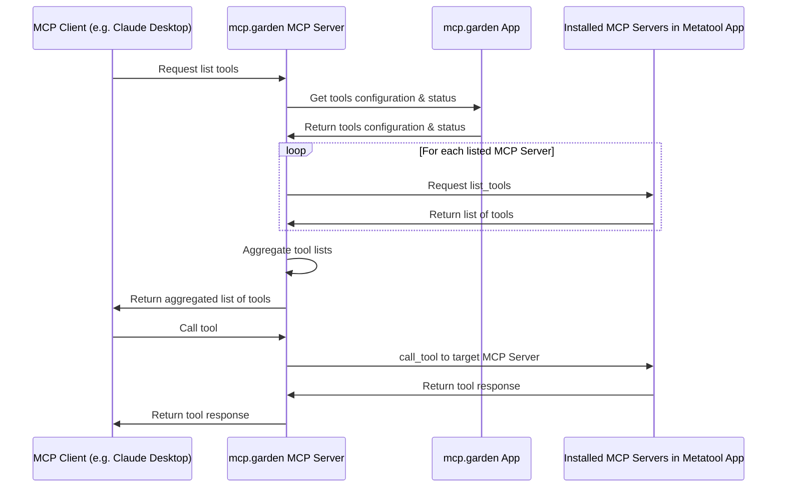

# mcp.garden Proxy MCP Server

[https://mcpgarden.com](https://mcpgarden.com): Ship Quickly With MCP

The mcp.garden MCP Server is a proxy server that joins multiple MCP⁠ servers into one. It fetches tool/prompt/resource configurations from your mcp.garden account⁠ and routes tool/prompt/resource requests to the correct underlying server.

[](https://smithery.ai/server/@metatool-ai/mcp-server-metamcp)

<a href="https://glama.ai/mcp/servers/0po36lc7i6">
  
</a>

mcp.garden App repo: https://github.com/metatool-ai/metatool-app

## Installation

### Installing via Smithery

Sometimes Smithery works (confirmed in Windsurf locally) but sometimes it is unstable because mcp.garden is special that it runs other MCPs on top of it. Please consider using manual installation if it doesn't work instead.

To install mcp.garden MCP Server for Claude Desktop automatically via [Smithery](https://smithery.ai/server/@metatool-ai/mcp-server-metamcp):

```bash
npx -y @smithery/cli install @metatool-ai/mcp-server-metamcp --client claude
```

### Manual Installation

```bash
export MCPGARDEN_API_KEY=<env>
npx -y @mcpgarden/server@latest
```

```json
{
  "mcpServers": {
    "mcp.garden": {
      "command": "npx",
      "args": ["-y", "@mcpgarden/server@latest"],
      "env": {
        "MCPGARDEN_API_KEY": "<your api key>"
      }
    }
  }
}
```

## Usage

### Using as a stdio server (default)

```bash
mcp-server-metamcp --metamcp-api-key <your-api-key>
```

### Using as an SSE server

```bash
mcp-server-metamcp --metamcp-api-key <your-api-key> --transport sse --port 12006
```

With the SSE transport option, the server will start an Express.js web server that listens for SSE connections on the `/sse` endpoint and accepts messages on the `/messages` endpoint.

### Command Line Options

```
Options:
  --metamcp-api-key <key>       API key for mcp.garden (can also be set via MCPGARDEN_API_KEY env var)
  --metamcp-api-base-url <url>  Base URL for mcp.garden API (can also be set via MCPGARDEN_API_BASE_URL env var)
  --report                      Fetch all MCPs, initialize clients, and report tools to mcp.garden API
  --transport <type>            Transport type to use (stdio or sse) (default: "stdio")
  --port <port>                 Port to use for SSE transport (default: "12006")
  -h, --help                    display help for command
```

## Environment Variables

- `MCPGARDEN_API_KEY`: API key for mcp.garden
- `MCPGARDEN_API_BASE_URL`: Base URL for mcp.garden API

## Development

```bash
# Install dependencies
npm install

# Build the application
npm run build

# Watch for changes
npm run watch
```

## Highlights

- Compatible with ANY MCP Client
- Multi-Workspaces layer enables you to switch to another set of MCP configs within one-click.
- GUI dynamic updates of MCP configs.
- Namespace isolation for joined MCPs.

## Architecture Overview



## Credits

- Inspirations and some code (refactored in this project) from https://github.com/metatool-ai/mcp-server-metamcp
  - Which had inspirations and some code (refactored in this project) from https://github.com/adamwattis/mcp-proxy-server/