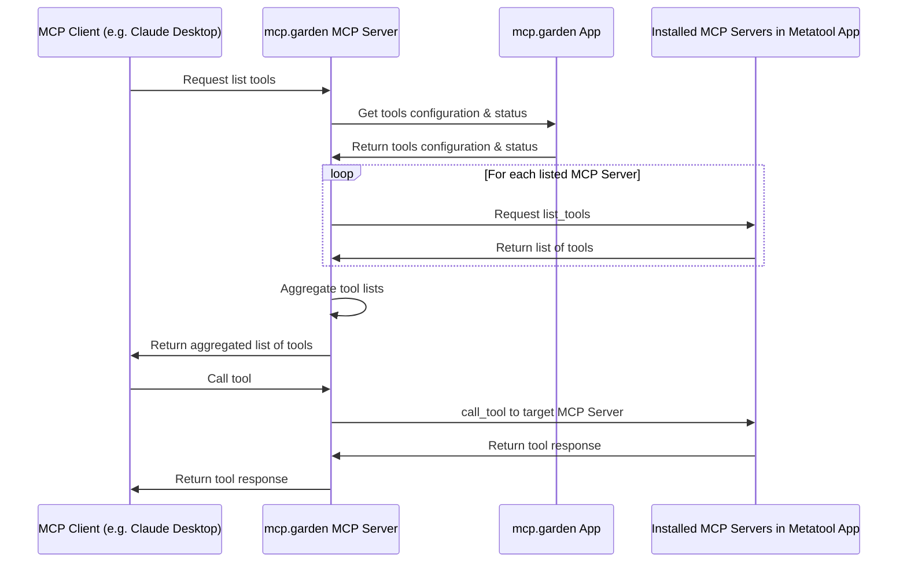

# mcp.garden Proxy MCP Server

[https://mcp.garden](https://mcp.garden): Ship Quickly With MCP

The mcp.garden MCP Server is a proxy server that joins multiple MCP⁠ servers into one. It fetches tool/prompt/resource configurations from your mcp.garden account⁠ and routes tool/prompt/resource requests to the correct underlying server.

## Installation

### Manual Installation

```bash
export MCPGARDEN_API_KEY=<env>
export MCPGARDEN_PROXY_SERVER_ID=<env>
npx -y @mcpgarden/server@latest
```

```json
{
  "mcpServers": {
    "mcp.garden": {
      "command": "npx",
      "args": ["-y", "@mcpgarden/server@latest"],
      "env": {
        "MCPGARDEN_API_KEY": "<your api key>",
        "MCPGARDEN_PROXY_SERVER_ID": "<your proxy server id>"
      }
    }
  }
}
```

## Usage

Set the required environment variables first:

```bash
export MCPGARDEN_API_KEY="<your-api-key>"
export MCPGARDEN_PROXY_SERVER_ID="<your-proxy-server-id>"
# Optional: export MCPGARDEN_API_BASE_URL="<your-custom-base-url>"
```

### Using as a stdio server (default)

```bash
mcpgarden-server
```

### Using as an SSE server

```bash
mcpgarden-server --transport sse --port 12006
```

With the SSE transport option, the server will start an Express.js web server that listens for SSE connections on the `/sse` endpoint and accepts messages on the `/messages` endpoint.

### Command Line Options

```
Options:
  --mcpgarden-api-key <key>     API key for mcp.garden (alternative to MCPGARDEN_API_KEY env var)
  --mcpgarden-api-base-url <url> Base URL for mcp.garden API (alternative to MCPGARDEN_API_BASE_URL env var)
  --report                      Fetch all MCPs, initialize clients, and report tools to mcp.garden API instead of starting the server
  --transport <type>            Transport type to use (stdio or sse) (default: "stdio")
  --port <port>                 Port to use for SSE transport (default: "3001")
  --require-api-auth            Require API key in SSE URL path for authentication (SSE transport only)
  -h, --help                    display help for command
```

## Environment Variables

- `MCPGARDEN_API_KEY`: (Required) API key for mcp.garden.
- `MCPGARDEN_PROXY_SERVER_ID`: (Required) The unique ID for this proxy server instance, obtained from mcp.garden.
- `MCPGARDEN_API_BASE_URL`: (Optional) Base URL for mcp.garden API (defaults to `https://mcp.garden`).

## Development

```bash
# Install dependencies
npm install

# Build the application
npm run build

# Watch for changes
npm run watch
```

## Highlights

- Compatible with ANY MCP Client
- Multi-Workspaces layer enables you to switch to another set of MCP configs within one-click.
- GUI dynamic updates of MCP configs.
- Namespace isolation for joined MCPs.

## Architecture Overview



## Credits

- Inspirations and some code (refactored in this project) from https://github.com/metatool-ai/mcp-server-metamcp
  - Which had inspirations and some code (refactored in this project) from https://github.com/adamwattis/mcp-proxy-server/
